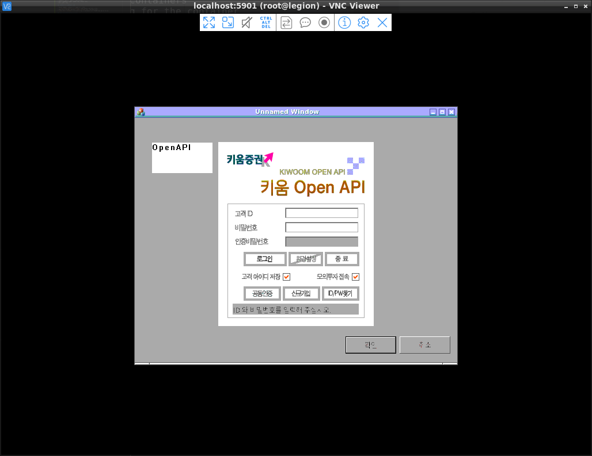
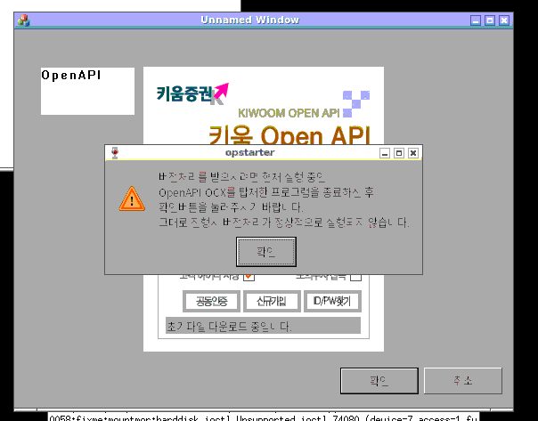
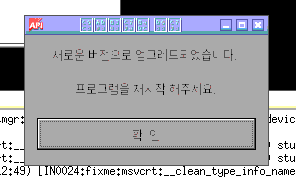
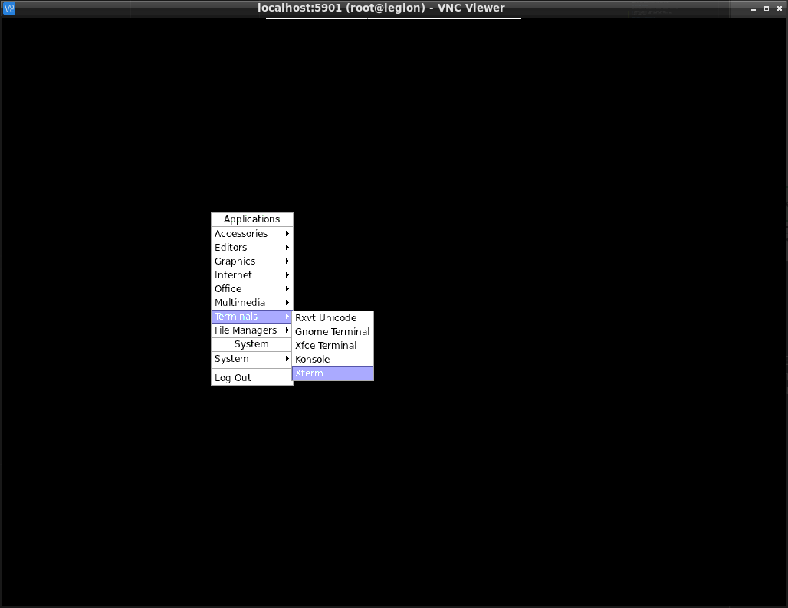
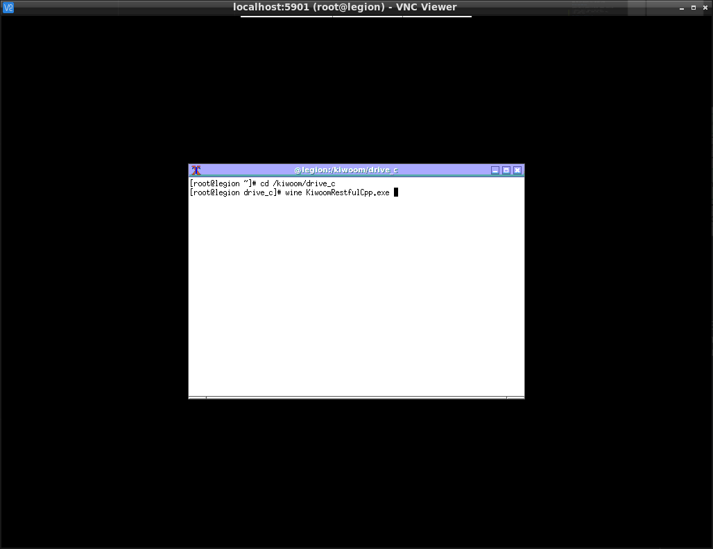
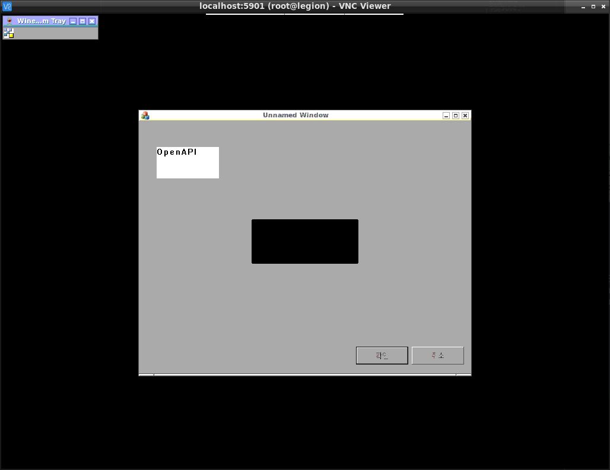
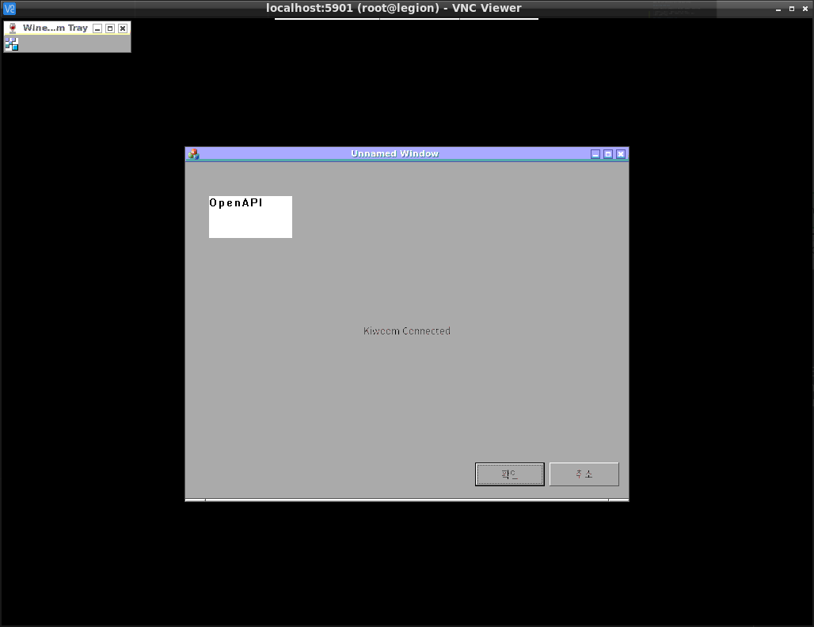
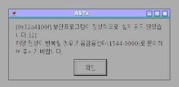
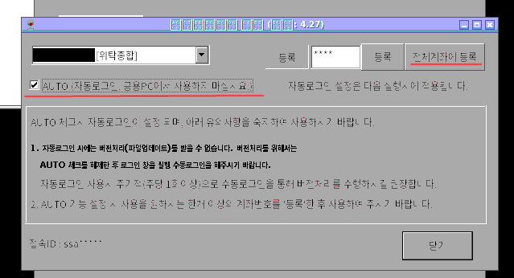

# Docker for Kiwoom OpenAPI

재현 가능성을 위해 docker로 wrapping함.

## 빌드

이 폴더 안에 OpenAPISetup.exe 를 배치한다.
그리고 빌드한 (혹은 github에서 받은) OpenAPISetup.exe 도 같이 둔다.

```
bash ./build.sh
```

와인, MFC 등이 설치되어야 해서 한참 걸릴 것이다.

## 인증서와 비번 입력

자동화를 위해서는 공동인증서를 복사하고 비번을 저장해야한다.

* 공동인증서 복사마저 와인으로 하긴 힘드니까,
* 그리고 공동인증서 갱신은 1년에 한번만 이루어지니까
꼼수를 쓰기로 하자.

### 공동인증서를 가져오는 꼼수

* 윈도우 머신에서 공동인증서를 갱신/발급 받는다.
* `C:\users\USER\AppData\LocalLow\NPKI` 여기 공인인증서가 있을 것이다.
* NPKI 폴더를 PC쪽에서 복사하여 `$HOME/.ssh/NPKI` 가 될 수 있도록하자.
* `chmod 700 ~/.ssh/NPKI` 로 권한을 소유자만 볼 수 있도록 해서 보안에 나름 신경을 써주자.

### VNC로 KiwoomRestfulCpp.exe 실행

`bash run_vnc.sh` 로 VNC 실행.
자동으로 VNC가 실행될 것이다.
참고로 openbox 세션이고 비밀번호는 123456이다.
비밀번호가 마음에 들지 않으면 `run_vnc.sh`를 열어서 수정하면 된다.

그리고 접속은 `localhost:5901` 로 하면 될 것이다.
아닐 수 있는데,
` vncext:      Listening for VNC connections on all interface(s), port 5901`
이런 메시지에 주목해서 알아내면 된다.

접속을 하면 아직 GUI가 "부팅중" 일 것이다.
기다렸다 접속해도 상관 없다.
xinitrc가 openbox를 실행하고,
openbox는 autostart에 서술된 프로그램을 실행하여
결국에는 `wine KiwoomRestfulCpp.exe`가 실행되는 구조이다.

이쯤에서 KiwoomRestfulCpp.exe의 command line argument에 대해 설명하는 것이 좋을 것 같다.
필요하다면 autostart를 고쳐서 docker 빌드하면 됨.

```
# http://localhost:12233 에 bind, default
wine KiwoomRestfulCppp.exe

# http://localhost:3333 에 bind. (첫 parameter가 port번호로 쓰임)
wine KiwoomRestfulCppp.exe 3333

# http://0.0.0.0:3333 에 bind.
# Parameter가 두개면 첫째가 bind address, 둘째가 port
wine KiwoomRestfulCppp.exe 0.0.0.0 3333
```

언급만하고 이후엔 그냥 default로 실행하겠음.



실행에 성공하면 이렇게 반가운 화면이 나올 것이다. 로그인 ㄱㄱ!

### 버전처리



로그인을 시도하면 위와 같이 버전처리에 대한 말이 나올 것이다.
윈도우에서도 마찬가지다.
Unnamed Window라고 된 창만 끄고 확인 버튼을 누른다.



성공하면 위와 같은 메시지가 나올 것이다.

### 로그인과 비번 입력

그런데 확인버튼을 누르면 아무것도 없는 검은 화면만 남을 것이다.
우클릭을 해서 xterm을 하나 켠다.



KiwoomRestfulCpp.exe 을 다시 실행한다:



```
cd /kiwoom/drive_c
wine KiwoomRestfulCpp.exe
```

그리고 로그인까지 해본다.



성공하면 스크린샷의 왼쪽 위처럼 트레이에 보여야 할 아이콘도 보임을 알 수 있다.



그리고 Unnamed Window 에 클릭해보면 connected로 상태가 바뀌어있다.



계속 켜놓으면 보안프로그램에 대한 불평을 하지만 무시해도 됨.



무시하고 트레이에 우클릭, 윈도우에서와 마찬가지로 계좌 비밀번호를 입력하고,
저장도 해서 자동로그인에 문제 없게 만들자.

이제 거의 다 됐다.
바탕화면에 우클릭해서 로그아웃을 하자.

## 재시작

로그아웃을 하면 GUI가 닫히고, VNC도 접속 종료되고,
Docker host에서 실행했던 `run_vnc.sh`도 끝날 것이다.

`run_vnc_saved.sh`에도 적혀있지만,
`docker start -i kiwoom_run`
로 명령어로 다시 켤 수 있다.
자동로그인을 위에서 성공적으로 해두었다면
바로 OpenAPI 창이 뜨면서 Kiwoom connected라고 뜰 것이다.

## 리눅스 서버에 서비스로 등록

제대로 되었으면 서버에서 `./run_vnc_saved.sh` 가 실행되어있기만 하면 (Ctrl+C로 종료)

```
data = {
    "accno": "키움계좌번호"
}
resp = requests.post("http://localhost:12233/balance", json=data)
result = resp.json()
```

이런 request를 보내면 국내주식 잔고가 잘 반환 될 것이다.
이를 주기적으로 켜고 끈다든지하려면 가장 좋은 것은 systemctl이다.

`systemctl --user` 를 자주 사용해야하니
`alias scu='systemctl --user'` 명령어를 쳐두자.

```
sudo loginctl enable-linger 유저명  # 유저가 재부팅 후 로그인하지 않아도 유저레벨 systemctl 작동
mkdir -p ~/.config/systemd/user
cd ~/.config/systemd/user
ln -s ~/PATH/TO/KiwoomRestfulCpp/docker/kiwoom.service
scu enable kiwoom.service
scu start kiwoom.service
```

도커 그룹에 속하지 않으면 서비스가 아무리 해도 실행이 잘 안 될 것이다.
도커 설치 후에 사용자를 /etc/group에서 docker그룹에 넣어주어도
재부팅 없이는 잘 인식이 안 되는 경우가 있기도 함.
시원하게 재부팅했다. 그러니 잘 된다.

`crontab -e` 주기적인 작업에 등록해서
한국시간으로 아침 6:30에 도커를 켜고,
저녁 6:30에 도커를 끄는 것을 추천한다.

```
# 0630 kiwoom start
32 21 * * 0-4  /usr/bin/systemctl --user start kiwoom
# 1830 kiwoom stop
32  9 * * 1-5  /usr/bin/systemctl --user stop kiwoom
```

이런 식이다.
